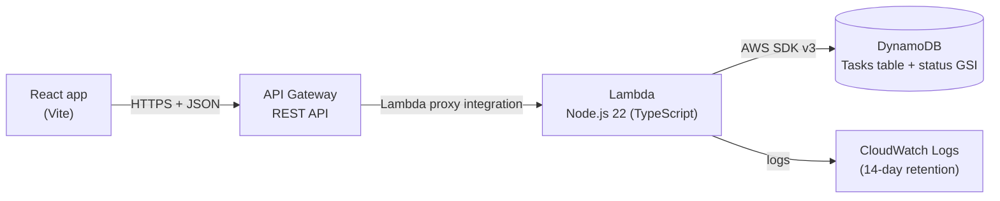

# Serverless Task Tracker

A small full-stack task tracker built on AWS serverless services: React + TypeScript on the front end, and API Gateway (REST) → Lambda (Node.js 22, TypeScript) → DynamoDB on the back end, all defined as infrastructure as code with AWS SAM.

Create, view, edit and delete tasks, set each task's status (`TODO`, `IN_PROGRESS`, `COMPLETED`), and filter the list by status.

The backend is deployed to AWS (`us-east-2`) with SAM. The frontend runs locally against either the local or the deployed API.

## Architecture



```text
React ──► API Gateway (REST, CORS, throttling) ──► Lambda ──► DynamoDB
                                                     │
                                                     └──► CloudWatch Logs
```

- **One Lambda serves all five routes.** API Gateway routes each method/path to the same function, and the function dispatches on `httpMethod` + `resource`. For five small CRUD routes this is simpler to deploy, test and reason about than five functions.
- **Thin handler, separate data layer.** [backend/src/app.ts](backend/src/app.ts) only handles HTTP: routing, validation, status codes and responses. [backend/src/taskRepository.ts](backend/src/taskRepository.ts) is the only code that talks to DynamoDB, behind a `TaskRepository` interface. Unit tests pass in an in-memory fake, so they never call AWS.
- **Shared types.** [shared/task.ts](shared/task.ts) defines `Task`, the status values and field limits once. Both the Lambda and the React app import it.

## AWS services used

| Service | What it does here |
|---|---|
| **Lambda** | Runs the API code (Node.js 22, TypeScript bundled by esbuild). No servers to manage; billed per request and duration. |
| **API Gateway (REST API)** | Public HTTPS endpoint. Routes requests to Lambda, answers CORS preflight requests, and throttles traffic (10 req/s, burst 20). |
| **DynamoDB** | Stores tasks. On-demand billing, with a global secondary index for filtering by status. |
| **IAM** | The Lambda's execution role grants only the 6 DynamoDB actions the code uses, on this table and its index only. No credentials in code. |
| **CloudWatch Logs** | Lambda logs in JSON format, kept for 14 days. |
| **CloudFormation (via SAM)** | [template.yaml](template.yaml) defines every resource above, so the whole stack is created, updated and deleted as one unit. |

## Project structure

```text
shared/            Task type, status values, field limits (used by backend + frontend)
backend/
  src/
    handler.ts     Lambda entry point: reads env vars, wires the real repository
    app.ts         Routing, validation, HTTP responses (no AWS code)
    validation.ts  Request body / query / path validation
    taskRepository.ts  TaskRepository interface + DynamoDB implementation
  tests/           Vitest unit tests + in-memory repository fake
  scripts/         create-local-table.mjs (DynamoDB Local setup)
frontend/
  src/
    api.ts         The only code that calls the API; turns failures into readable messages
    App.tsx        State: task list, filter, editing, loading/error states
    components/    TaskForm (create + edit), TaskItem, StatusFilter
  .env.example     Copy to .env.local and set VITE_API_URL
template.yaml      SAM template: table, API, Lambda, IAM policy, log group
samconfig.toml     Default SAM CLI settings (stack name, region, parameters)
docker-compose.yml DynamoDB Local for local development
env.local.json     Environment variables for `sam local`
```

## API

Base URL: `http://127.0.0.1:3000` locally, or the `ApiUrl` stack output once deployed. Request and response bodies are JSON.

| Method | Path | Description | Success |
|---|---|---|---|
| `GET` | `/tasks` | List tasks, newest first. Optional `?status=TODO\|IN_PROGRESS\|COMPLETED` | `200` + array |
| `GET` | `/tasks/{id}` | Get one task | `200` + task |
| `POST` | `/tasks` | Create a task | `201` + task |
| `PUT` | `/tasks/{id}` | Replace a task's editable fields | `200` + task |
| `DELETE` | `/tasks/{id}` | Delete a task | `204`, empty body |

**Task:**

```json
{
  "id": "48686a7e-0b5d-4f7c-9ad6-ceebc259b73c",
  "title": "Learn DynamoDB",
  "description": "GSIs",
  "status": "TODO",
  "dueDate": "2026-10-31",
  "createdAt": "2026-10-05T20:48:20.862Z",
  "updatedAt": "2026-10-05T20:48:20.862Z"
}
```

**Request body** (POST and PUT):

| Field | Rules | Default |
|---|---|---|
| `title` | Required, non-empty, at most 200 characters (trimmed) | – |
| `description` | String, at most 2000 characters | `""` |
| `status` | `TODO`, `IN_PROGRESS` or `COMPLETED` | `"TODO"` |
| `dueDate` | `YYYY-MM-DD` (a real calendar date) or `null` | `null` |

`id`, `createdAt` and `updatedAt` are set by the server; sending them, or any other unknown field, is rejected. `PUT` is a full replacement, so omitted optional fields reset to their defaults.

**Errors** always have the shape `{ "message": "..." }`:

| Status | When |
|---|---|
| `400` | Invalid JSON, failed validation, unknown status filter, or an id that isn't a UUID |
| `404` | Task not found, or unknown route (API Gateway's default 403 "Missing Authentication Token" is remapped to a 404 in the template) |
| `429` | Throttled by API Gateway |
| `500` | Unexpected error. The client sees only `Internal server error`; details go to CloudWatch Logs. |

## DynamoDB design

DynamoDB isn't a relational database: you design keys around how the data is **read**, because efficient reads go through keys, not arbitrary `WHERE` clauses.

**Access patterns:**

1. Get, update or delete one task by id
2. List all tasks
3. List tasks with a given status

**Table:** partition key `id` (a UUID string). Pattern 1 uses single-item operations (`GetItem` / `UpdateItem` / `DeleteItem`), the cheapest and fastest reads and writes DynamoDB offers. Updates and deletes use condition expressions (`attribute_exists(id)`), so a missing task becomes a clean 404 rather than an accidental "upsert".

**Global secondary index `status-createdAt-index`:** partition key `status`, sort key `createdAt`, projecting all attributes. A GSI is a second copy of the data, kept in sync by DynamoDB, organized by different keys. `GET /tasks?status=X` is a `Query` on this index: it reads **only** the tasks with that status, already sorted newest-first.

**Why a GSI rather than a Scan with a filter?** A `Scan` with `FilterExpression` reads (and bills for) every item in the table, then throws away the non-matching ones. A GSI query reads only what it returns.

**Tradeoffs, honestly:**

- **Writes cost more.** Every write to the table also writes to the index, and the index stores a second copy of each item (`ProjectionType: ALL`). At this scale that's a fraction of a cent.
- **Low-cardinality partition key.** `status` has only 3 values, so at very high traffic all `TODO` tasks would share one index partition (a "hot partition"). For a single-user app this is irrelevant. At scale, the key would include the user (see below).
- **Unfiltered `GET /tasks` uses a Scan.** For one user's few hundred tasks, a Scan is a few read units, and sorting in the Lambda is trivial. It does not scale to large tables. With multiple users, a `Query` on a `userId` partition key would replace it.
- **No pagination in the API (v1).** The repository follows DynamoDB's `LastEvaluatedKey` to return all results. Fine for a personal task list; a larger app would expose a `nextToken`.

**When adding Cognito (multi-user):** change the table key to partition key `userId` + sort key `taskId`, and the GSI to partition key `userId#status` + sort key `createdAt`. Every read then becomes a `Query` scoped to one user, which removes both the Scan and the hot-partition concern. The `TaskRepository` interface would gain a `userId` parameter, and the handler would read it from the Cognito authorizer claims.

**Billing:** on-demand (`PAY_PER_REQUEST`). There's no capacity to plan or pay for while idle, which is the right fit for sporadic personal traffic.

## Security

- **No credentials in code.** In AWS, the Lambda gets temporary credentials from its IAM execution role. Locally, `sam local` uses your AWS CLI profile, and DynamoDB Local accepts dummy credentials.
- **Least-privilege IAM.** The Lambda's policy in [template.yaml](template.yaml) allows only `GetItem`, `PutItem`, `UpdateItem`, `DeleteItem` and `Scan` on the tasks table, and `Query` only on its status index. It deliberately avoids SAM's broader `DynamoDBCrudPolicy` (which also grants batch operations and more). SAM's standard `AWSLambdaBasicExecutionRole` lets it write logs.
- **Input validation.** Every body, query parameter and path id is validated, and unknown fields are rejected. See [backend/src/validation.ts](backend/src/validation.ts).
- **No leaked internals.** Unexpected errors return a generic `500` message. The stack trace is logged to CloudWatch, never sent to the client.
- **Throttling.** The API has no auth in v1, so API Gateway limits it to 10 requests/s (burst 20) to cap abuse and cost.
- **CORS is restricted to one origin** (the `AllowedOrigin` parameter, `http://localhost:5173` by default), not `*`. CORS only controls which *websites* a browser lets call the API. It doesn't stop `curl` or scripts (that's what auth and throttling are for), but it prevents a random site from using a visitor's browser to call the API. The Lambda adds the header to its own responses; API Gateway adds it to preflight `OPTIONS` responses and to its own errors (throttling, unknown routes).

## Configuration

| Setting | Where | Purpose |
|---|---|---|
| `Stage` | SAM parameter (`samconfig.toml`) | API stage name in the URL, e.g. `dev` |
| `AllowedOrigin` | SAM parameter | The one origin allowed by CORS |
| `TABLE_NAME` | Lambda env var, set from the table resource | Table to read and write |
| `ALLOWED_ORIGIN` | Lambda env var, from `AllowedOrigin` | CORS header in Lambda responses |
| `DYNAMODB_ENDPOINT` | Lambda env var, empty in AWS | Points `sam local` at DynamoDB Local |
| `VITE_API_URL` | `frontend/.env.local` | API base URL for the React app |

## Local development

**Prerequisites:** Node.js 20+, AWS CLI v2 (configured), AWS SAM CLI, and Docker Desktop (running).

```bash
# 1. Install backend dependencies (also needed before every `sam build`)
cd backend && npm install && cd ..

# 2. Start DynamoDB Local (Docker) and create the local table
docker compose up -d
npm --prefix backend run local:table

# 3. Bundle the Lambda and start the API on http://127.0.0.1:3000
sam build
sam local start-api
```

Everything runs on your machine. `sam local` runs the Lambda in a Docker container with the same Node.js 22 runtime as AWS, and samconfig.toml points it at `env.local.json` and the `task-tracker-local` Docker network, so it talks to DynamoDB Local instead of AWS.

Try it:

```bash
curl -X POST http://127.0.0.1:3000/tasks -H "Content-Type: application/json" -d '{"title":"My first task"}'
curl http://127.0.0.1:3000/tasks
curl "http://127.0.0.1:3000/tasks?status=TODO"
```

After changing backend code, re-run `sam build` (no need to restart `sam local`). DynamoDB Local keeps data in memory, so after `docker compose down` or a restart, run `npm --prefix backend run local:table` again.

**Frontend** (in a second terminal):

```bash
cd frontend
npm install
cp .env.example .env.local     # VITE_API_URL=http://127.0.0.1:3000
npm run dev                    # http://localhost:5173
```

The dev server is pinned to port 5173 because that's the one origin the API's CORS setting allows.

Stop everything: `Ctrl+C` in the `npm run dev` and `sam local` terminals, then `docker compose down`.

## Frontend

A single-page React app (no router, no state library) with plain CSS that follows the system light/dark setting.

- **List and filter.** Tasks show newest first. The All / To do / In progress / Completed filter calls `GET /tasks?status=...`, so filtering uses the DynamoDB index rather than the browser.
- **Create, edit, delete.** One `TaskForm` component handles both creating and editing. Status can also be changed inline from each row. Deletes ask for confirmation.
- **Loading, empty and error states.**
  - A loading message shows while fetching.
  - The empty state is filter-aware ("No tasks yet" vs. "No tasks with status 'To do'").
  - A failed load shows a message with a "Try again" button.
- **Readable errors.**
  - Validation messages from the API (`400`) appear next to the form.
  - Network failures, throttling (`429`) and server errors (`5xx`) get friendly messages.
  - If a task was deleted somewhere else, a stale edit or status change removes it from the list and explains why. Deleting an already-deleted task counts as success.
- **Config.** The API base URL comes from `VITE_API_URL`, a Vite environment variable baked in at build time. Only variables prefixed `VITE_` are exposed to browser code, so nothing secret belongs there.

## Running tests

```bash
cd backend
npm test            # Vitest unit tests (no AWS calls)
npm run typecheck   # TypeScript type check

cd ../frontend
npm run build       # type-checks and builds the frontend
```

The tests call the real handler with API Gateway-shaped events and an in-memory repository. They cover every route, validation failures, 404s, CORS headers and generic 500s.

## Deployment

> ⚠️ Deploying creates billable AWS resources. At personal-project traffic the cost is a few cents at most, and on the AWS Free plan it's covered by credits. Clean up when you're done (see below).

**Prerequisites:** AWS CLI configured (`aws sts get-caller-identity` works) and `npm install` already run in `backend/`.

```bash
sam build      # bundle the Lambda with esbuild into .aws-sam/
sam deploy     # shows the change set, waits for "y", then creates/updates the stack
```

`samconfig.toml` supplies the stack name (`serverless-task-tracker`), region (`us-east-2`), parameters and `CAPABILITY_IAM`, so no `--guided` run is needed. On the first deploy, SAM also creates a small helper stack, `aws-sam-cli-managed-default`, holding an S3 bucket for the uploaded code.

When the deploy finishes, copy the `ApiUrl` output into `frontend/.env.local`:

```bash
VITE_API_URL=https://<api-id>.execute-api.us-east-2.amazonaws.com/dev
```

**Change the allowed CORS origin** (e.g. once the frontend is hosted somewhere):

```bash
sam deploy --parameter-overrides Stage=dev AllowedOrigin=https://tasks.example.com
```

**Look at logs:** in the AWS Console under CloudWatch → Log groups → `/aws/lambda/serverless-task-tracker-task-function`, or from the terminal:

```bash
sam logs --stack-name serverless-task-tracker --tail
```

Each request logs a JSON line such as `{"level":"INFO","requestId":"...","message":"POST /tasks -> 201"}`. Lambda's own `platform.report` lines show duration, memory and cold-start init time. Measured on the deployed stack: about 34 ms per warm request, about 345 ms cold-start init, and 106 MB of the 256 MB allocated.

## Cleanup

Delete everything so nothing keeps costing money. There are two CloudFormation stacks in **us-east-2**.

**1. The app stack.** Removes the API, Lambda, DynamoDB table (**and all task data**), IAM role and log group:

```bash
sam delete --stack-name serverless-task-tracker --region us-east-2
```

Answer `y` to both prompts (delete the stack, and delete its artifacts in S3).

**2. SAM's helper stack and its S3 bucket.** The bucket has versioning enabled, and CloudFormation can only delete an empty bucket, so empty it first:

1. AWS Console → **S3** → bucket `aws-sam-cli-managed-default-samclisourcebucket-...` → **Empty** → type `permanently delete` → confirm. This removes all object versions.
2. Delete the helper stack (this also deletes the now-empty bucket):

   ```bash
   aws cloudformation delete-stack --stack-name aws-sam-cli-managed-default --region us-east-2
   aws cloudformation wait stack-delete-complete --stack-name aws-sam-cli-managed-default --region us-east-2
   ```

**3. Verify.** Both commands should print nothing:

```bash
aws cloudformation list-stacks --region us-east-2 --stack-status-filter CREATE_COMPLETE UPDATE_COMPLETE --query "StackSummaries[].StackName" --output text
aws s3 ls | grep aws-sam-cli-managed-default
```

Locally, `docker compose down` stops DynamoDB Local.

## Lessons learned

- **DynamoDB is designed around access patterns.** The key design and GSI came from listing the three reads the app needs, not from a table schema. Filtering through an index (`Query`) instead of a `Scan` + `FilterExpression` is the difference between reading the matching items and reading the whole table.
- **Keep AWS out of the core logic.** Putting DynamoDB behind a `TaskRepository` interface made the handler testable with a 30-line in-memory fake, so 31 tests run in under a second without touching AWS.
- **SAM's esbuild build has sharp edges.** In `build_in_source` mode, SAM runs a production `npm install` inside the source folder, which removed the dev dependencies (esbuild, Vitest, TypeScript) from `backend/node_modules`. Pointing `CodeUri` at `backend/src`, which has no `package.json`, makes SAM bundle in place without touching `node_modules`, and lets esbuild follow imports into `../shared`.
- **Debugging an Organizations SCP.** The first deploy failed with an *explicit deny in a service control policy*. AdministratorAccess on the IAM user couldn't override it, and the policy wasn't readable from the member account. Running `aws iam simulate-principal-policy` (which reports whether Organizations allows each action) against the actions SAM needs showed that CloudFormation, Lambda, DynamoDB and S3 were denied in every region **except `us-east-2`**: an `aws:RequestedRegion` guardrail. The fix was to deploy to the allowed region, not to loosen the guardrail.
- **With Lambda proxy integration, CORS is split between two places.** API Gateway answers the `OPTIONS` preflight, but the Lambda must add `Access-Control-Allow-Origin` to its own responses, and API Gateway's own errors (throttling, unknown routes) need gateway responses with the header too. Otherwise the browser hides the real error.
- **Log retention is opt-in.** By default, Lambda log groups keep data forever. Defining the log group in the template with `RetentionInDays: 14` fixes that, and also means it's deleted with the stack.

## Future improvements

- **Authentication with Amazon Cognito** and per-user data (see the DynamoDB design notes above)
- **CI/CD** (e.g. GitHub Actions running tests and `sam deploy`)
- **Frontend hosting** on S3 + CloudFront, with `AllowedOrigin` set to the CloudFront domain
- API pagination with a `nextToken`
- API Gateway access logs and CloudWatch alarms on Lambda errors
